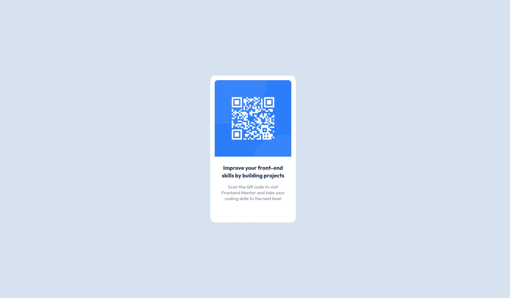

# QR code Card component solution

This is a solution to the [QR code component challenge on Frontend Mentor](https://www.frontendmentor.io/challenges/qr-code-component-iux_sIO_H). Frontend Mentor challenges help you improve your coding skills by building realistic projects.

## Table of contents

- [Overview](#overview)
  - [Screenshot](#screenshot)
  - [Links](#links)
- [My process](#my-process)
  - [Built with](#built-with)
  - [What I learned](#what-i-learned)
  - [Continued development](#continued-development)

## Overview

Made this cool QR code card component.

### Screenshot



### Links

- Solution URL: [Add solution URL here](https://your-solution-url.com)
- Live Site URL: [Add live site URL here](https://your-live-site-url.com)

## My process

### Built with

- HTML divs and img
- settin
- CSS properties
  - Used flexbox to position the card in center.
  - Used class based styling
  - Used padding for spacings

### What I learned

I learnt to work on design withour looking in figma or any design doc. It is a good practice to identify the properties of any UI by looking at it's image only.


Proud of centering the div on screen 😁

```css
.card-wrapper {
  width: 100vw;
  height: 100vh;
  background-color: hsl(212, 45%, 89%);
  display: flex;
  justify-content: center;
  align-items: center;
}
```

### Continued development

I want to work more on responsiveness of any design.
